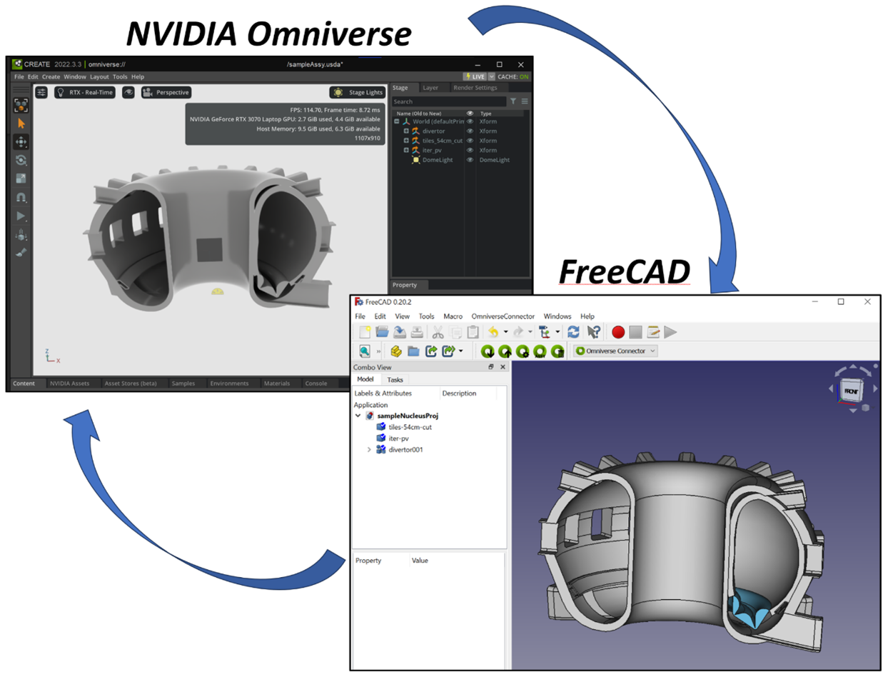

.. FreeCAD-Omniverse documentation master file, created by
   sphinx-quickstart on Wed Jun 12 16:57:49 2024.
   You can adapt this file completely to your liking, but it should at least
   contain the root `toctree` directive.

FreeCAD-Omniverse Documentation
=============================================

Table of Contents
------------------
.. toctree::
   :maxdepth: 3

   introduction
   installation/launcher_setup
   installation/install_all
   system/system
   user_interface/user_interface
   how_to/how_to_all

Indices and tables
------------------

* :ref:`genindex`
* :ref:`modindex`
* :ref:`search`
